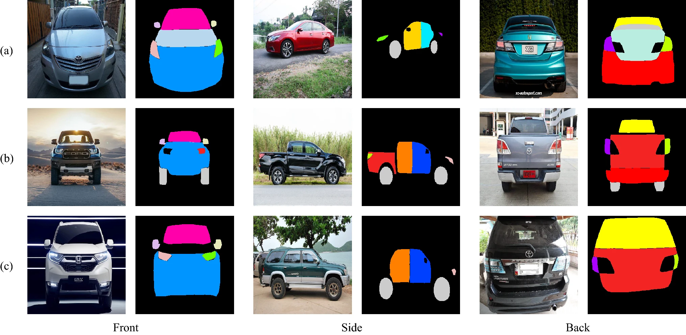
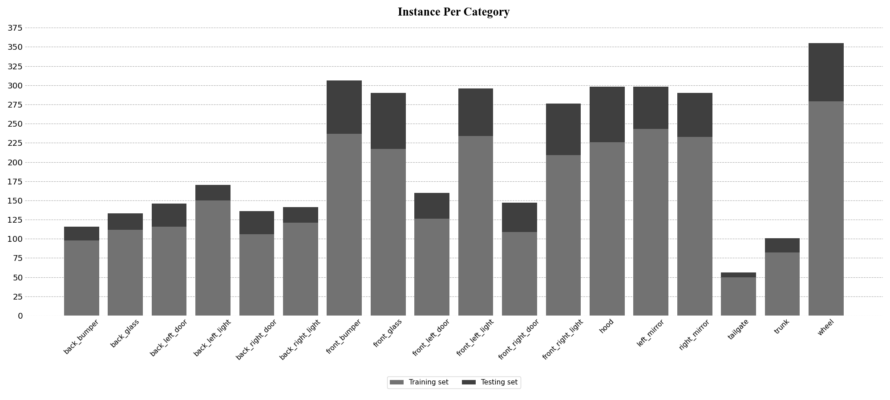

# Car Parts Dataset
**_Kitsuchart Pasupa, Phongsathorn Kittiworapanya, Napasin Hongngern & Kuntpong Woraratpanya_**

---

> 🎉**Release V.2** - We update the annotation of this data set for more converage and consistencies.

This repository contains annotated data of car parts available for object detection and semantic segmentation tasks, appeared in the paper "[Evaluation of deep learning algorithms for semantic segmentation of car parts](https://link.springer.com/article/10.1007/s40747-021-00397-8)"



## Details
- The data set contains 500 images of sedans, pickups and sports utility vehicles (SUVs).
- The annotations are contained in the format of COCO Dataset.
- The images of these vehicles were taken in multiple views (front, back and angled views).
- The images were anonymized, e.g., car license plate, faces.
- Each image was annotated by the 18 listed instance masks and bounding boxes:

`back_bumper`, `back_glass`, `back_left_door`, `back_left_light`, `back_right_door`, `back_right_light`, `front_bumper`, `front_glass`, `front_left_door`, `front_left_light`, `front_right_door`, `front_right_light`, `hood`, `left_mirror`, `right_mirror`, `tailgate`, `trunk` (of trucks and SUVs), and `wheel` (wheel and tire).



## How to use this data
- [Example (Python)](Example.ipynb)

## Citation
If this work is helpful in your research, please cite and star:
- Pasupa, K., Kittiworapanya, P., Hongngern, N., & Woraratpanya, K. (2021). Evaluation of deep learning algorithms for semantic segmentation of car parts. Complex & Intelligent Systems, 1–13. doi: [10.1007/s40747-021-00397-8](https://doi.org/10.1007/s40747-021-00397-8)

```bibtex
@article{DSMLR_Carparts,
	author = {Pasupa, Kitsuchart and Kittiworapanya, Phongsathorn and Hongngern, Napasin and Woraratpanya, Kuntpong},
	title = {{Evaluation of deep learning algorithms for semantic segmentation of car parts}},
	journal = {Complex {\&} Intelligent Systems},
	pages = {1--13},
	year = {2021},
	month = {May},
	issn = {2198-6053},
	publisher = {Springer International Publishing},
	doi = {10.1007/s40747-021-00397-8}
}
```